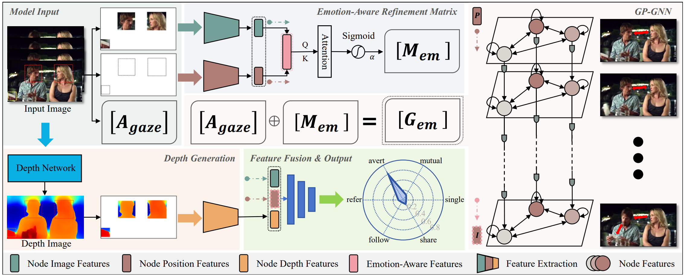

# GIBRNet: A Multimodal Spatiotemporal Reasoning Network Integrating Emotion, Gaze, and Position for Gaze Interaction Behavior Recognition

**🚩Accepted by CogSCI 2025！✨ **

---

## Abstract

Gaze Interaction Behavior Recognition (GIBR) plays a significant role in understanding social behaviors and diagnosing mental health conditions. However, existing methods are limited by inadequate task modeling, resulting in suboptimal performance. To address this issue, we model the GIBR task as a spatiotemporal reasoning problem integrating three modalities: emotion, gaze, and position. Based on this, we propose GIBRNet, which enhances the representation of gaze interaction tendencies through an Emotion-Aware Refinement Matrix and dynamically aggregates multi-frame, multi-modal information using GP-GNN, enabling more precise interaction behavior reasoning. Comparative experiments on the VACATION dataset demonstrate that GIBRNet significantly outperforms existing approaches. Additionally, we constructed a GIBR dataset suite, consisting of three extended datasets, for generalization evaluation, demonstrating GIBRNet’s superiority. 

---

## Dataset Download

The GIBR dataset suite can be downloaded here ~ 😀

